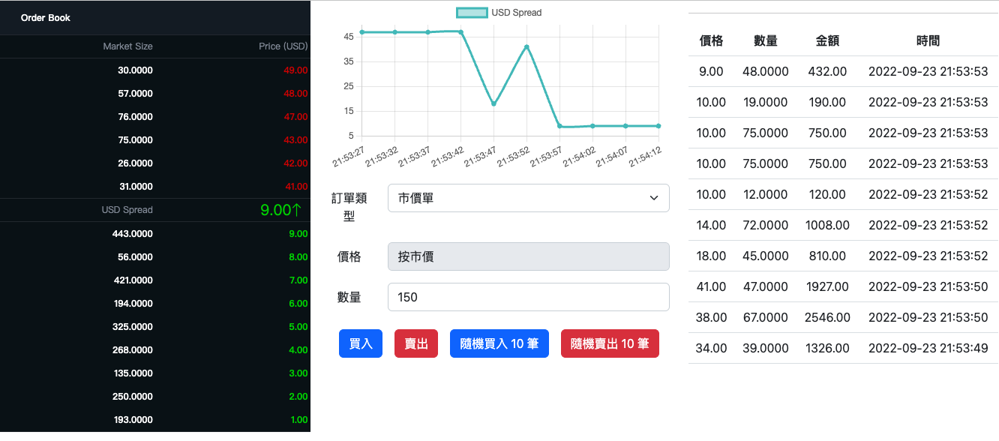

# go-trade-engine-demo


### Z司面試作業

想像你擁有一個交易系統允許使用任何自訂的傳輸協議並且可以以價格與數量分別完成限價單、市價單下單。

同樣價格的買賣委託需要被撮合，並遵守價格優先且時間優先。未被撮合的委託需要被紀錄在系統中直到被撮合或被徹單。此系統需要滿足同時多位使用者執行下單的需求。

### 開發需求：

- 以 SOLID 原則實現易擴充的架構設計。
- 可測試可打包可執行的程式碼。
- 考量併發以及線程安全。
- Golang 為理想語言但不是必須。

### Demo



Demo : [http://ec2-13-231-126-71.ap-northeast-1.compute.amazonaws.com/](http://ec2-13-231-126-71.ap-northeast-1.compute.amazonaws.com/)

### 專案講解

 此專案為以 `Golang` 作為後端以及 `React` 做為前端實現單體式交易撮合系統，此專案目的為實現交易撮合功能所以買賣方進行委託時將不會考慮用戶持有資產、持有單位數量以及成交手續費...等外部邏輯。
 專案架構以 `Clean Architecture` 為核心實踐 SOLID 原則，期望實現高內聚低耦合、可讀可擴充的程式品質。

```yaml
├── build
│   ├── trade
│   │   └── dockerfile
│   └── web
│       └── dockerfile
├── cmd
│   └── trade
│       └── main.go
├── deoloyments
│   └── deployment.yaml
├── docker-compose.yml
├── go.mod
├── go.sum
├── internal
│   └── trade
│       ├── constants
│       ├── entity
│       ├── handler
│       ├── pkg
│       ├── repository
│       ├── service
│       └── util
└── web
```

使用 `Priority Queue` 解決交易撮合時需要以價格優先其次時間優先的要求，並使用 Golang 自帶互斥鎖避免同時讀寫資料時造成的 `Data Race` 以及線程安全問題。

以 WebSocket 多人聊天室 `Broadcasting` 群聊訊息的概念，推播給每個 wss 連線至此交易撮合系統的用戶即時交易訊息(成交價、下單委託、成交紀錄…)。

---

### 使用環境及工具

- 前端：React + Vite
- 後端：Golang(Gin, WebSocket)

### **如何運行該專案(使用docker-compose)**

可利用本專案的docker-compose.yaml會一次啟動Backend、Frontend，方便直接運行測試。請確保主機有docker環境，如果是Linux環境則需要另外安裝docker-compose套件。而如果是Windows、Mac則只需要安裝Docker Desktop即可。

```yaml
# 透過 git clone 專案到主機任意路徑下
git clone https://github.com/MikeHsu0618/go-trade-engine-demo.git
```

運行專案：

```
# 在本專案的根目錄下執行以下指令即可
cp go-trade-engine-demo
docker compose up -d
```

### Restful API (Back-end)

- starts a server on localhost port 8080 (by default).
- [http://localhost:8080/api/v1/trade](http://localhost:8080//api/v1/trade)

| Method | Path | Usage |
| --- | --- | --- |
| GET | /depth | 取得買賣委託深度及成交價 |
| GET | /log | 取得成交紀錄 |
| POST | /orders | 成立訂單(限價/市價) |
| POST | /randomOrders | 成立隨機十筆訂單 |
| DELETE | /orders | 撤銷訂單 |
| GET | /ws | 建立 WebSocket 連線並取得最新成交價、委託、成交紀錄… |

### Reference

[https://www.liaoxuefeng.com/article/1452011784503329](https://www.liaoxuefeng.com/article/1452011784503329)

[https://github.com/yzimhao/trading_engine](https://github.com/yzimhao/trading_engine)

[https://cloud.tencent.com/developer/article/1470996](https://cloud.tencent.com/developer/article/1470996)

[https://www.cnblogs.com/zdz8207/p/qkl-CoinExchange-market.html](https://www.cnblogs.com/zdz8207/p/qkl-CoinExchange-market.html)

[https://github.com/fmstephe/matching_engine](https://github.com/fmstephe/matching_engine)
